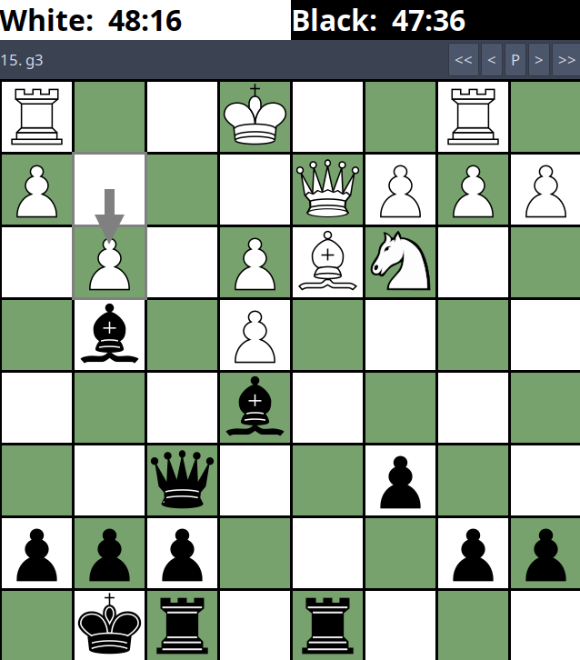
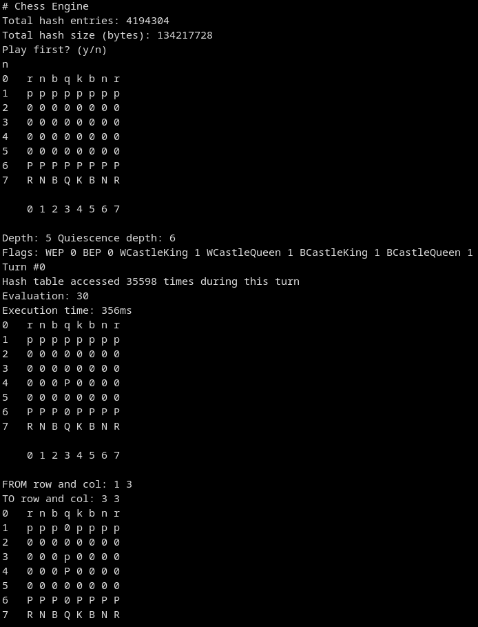

# Chess Engine

Chess engine in C++, absolute minimum compliance to work with XBoard protocol
(CECP).

## Board Representation
* Bitboards
* Magic bitboards

## Search
* Minimax with alpha-beta pruning
* Transposition table
* Move ordering from hash
* Quiescence

## Evaluation
* Material
* Piece position

Playing using XBoard

  

Playing using command line

  

